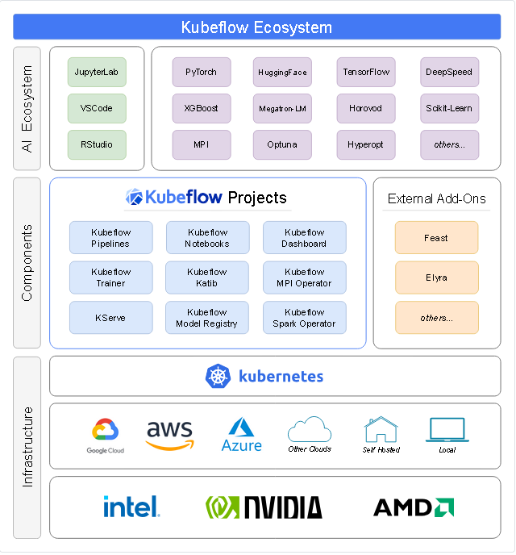

# kubespray-2.27.0 部署笔记、Kubeflow manifests-1.9.1 部署笔记

### 4.1.kubespray-2.27.0 部署笔记

4.1.kubespray-2.27.0

```text
kubespary:
https://github.com/kubernetes-sigs/kubespray/archive/refs/tags/v2.27.0.tar.gz

ubuntu-22.04.5-live-server-amd64.iso
ubuntu-24.10-live-server-amd64.iso  #完成测试，但是不习惯python的管理工具
```

设置基础环境

```text
sed -i 's/SELINUX=enforcing/SELINUX=disabled/g' /etc/selinux/config;
sed -i 's/GSSAPIAuthentication yes/GSSAPIAuthentication no/g' /etc/ssh/sshd_config;
echo "GSSAPIAuthentication no" >> /etc/ssh/sshd_config;
sed -i 's/UseDNS yes/UseDNS no/g' /etc/ssh/sshd_config;
cat >> /etc/ssh/sshd_config <<EOF
UseDNS no
PermitRootLogin yes
EOF

systemctl restart sshd;

cp /etc/apt/sources.list /etc/apt/sources.list.original;
cat > /etc/apt/sources.list <<EOF
# 默认注释了源码镜像以提高 apt update 速度，如有需要可自行取消注释
deb https://mirrors.tuna.tsinghua.edu.cn/ubuntu/ jammy main restricted universe multiverse
# deb-src https://mirrors.tuna.tsinghua.edu.cn/ubuntu/ jammy main restricted universe multiverse
deb https://mirrors.tuna.tsinghua.edu.cn/ubuntu/ jammy-updates main restricted universe multiverse
# deb-src https://mirrors.tuna.tsinghua.edu.cn/ubuntu/ jammy-updates main restricted universe multiverse
deb https://mirrors.tuna.tsinghua.edu.cn/ubuntu/ jammy-backports main restricted universe multiverse
# deb-src https://mirrors.tuna.tsinghua.edu.cn/ubuntu/ jammy-backports main restricted universe multiverse
deb https://mirrors.tuna.tsinghua.edu.cn/ubuntu/ jammy-security main restricted universe multiverse
# deb-src https://mirrors.tuna.tsinghua.edu.cn/ubuntu/ jammy-security main restricted universe multiverse

# 预发布软件源，不建议启用
# deb https://mirrors.tuna.tsinghua.edu.cn/ubuntu/ jammy-proposed main restricted universe multiverse
# deb-src https://mirrors.tuna.tsinghua.edu.cn/ubuntu/ jammy-proposed main restricted universe multiverse
EOF

apt update -y;
apt list --upgradable;
apt upgrade -y;

# 为了解决这个WARNING：
#########################################################
root@x:~# netplan apply
WARNING:root:Cannot call Open vSwitch: ovsdb-server.service is not running.
#########################################################
chmod 600 /etc/netplan/*
touch /etc/cloud/cloud-init.disabled;
apt -y install openvswitch-switch;
systemctl disable openvswitch-switch.service;

# 运行在init 3
systemctl isolate multi-user.target;
systemctl isolate runlevel3.target;
ln -sf /lib/systemd/system/multi-user.target /etc/systemd/system/default.target;
systemctl set-default multi-user.target;

# 关闭不需要的服务：
systemctl list-unit-files |awk '{ print $1,$2 }'|grep enable|egrep -v "ssh|multi|systemd-resolved|wpa_" |awk '{ print $1}'|xargs -i systemctl disable {};

# 确认服务已关闭：
systemctl list-unit-files |awk '{print $1,$2}'|grep enabled;

apt install -y python3-pip python3 python3-netaddr wget git;
apt install -y python3-dev;
pip install --upgrade pip;

pip3 config set global.index-url https://pypi.tuna.tsinghua.edu.cn/simple;
mkdir -p /root/.config/pip;
cat > /root/.config/pip/pip.conf <<EOF
[global]
index-url = https://pypi.tuna.tsinghua.edu.cn/simple
EOF

# 以下配置host及环境：
cat > /etc/hostname <<EOF
k101
EOF

cat >> /etc/hosts <<EOF
192.168.32.101 k101
EOF

hostname k101;

cat >> /etc/profile <<EOF
ulimit -S -c 0 > /dev/null 2>&1
ulimit -n 10240
ulimit -u 77823
EOF

cat >> /etc/sysctl.conf <<EOF
net.ipv4.ip_forward=1
net.ipv4.conf.all.rp_filter=0
net.ipv4.conf.default.rp_filter=0
net.ipv6.conf.all.disable_ipv6 = 1
net.ipv6.conf.default.disable_ipv6 = 1
net.ipv6.conf.lo.disable_ipv6 = 1

net.bridge.bridge-nf-call-iptables = 1
net.bridge.bridge-nf-call-ip6tables = 1

fs.inotify.max_user_instances=2280
fs.inotify.max_user_watches=655360
EOF

ssh-keygen -t rsa -N "";
cat /root/.ssh/id_rsa.pub >> /root/.ssh/authorized_keys;
```


下载和修改kubespary，安装

```text
wget https://github.com/kubernetes-sigs/kubespray/archive/refs/tags/v2.27.0.tar.gz

#安装 kubespray 依赖
cd /opt/kubespray-2.27.0;

# 安装依赖
pip3 install -r requirements.txt;

# 复制一份 自己的配置
cd /opt/kubespray;
cp -au /opt/kubespray-2.24.1/inventory/sample /opt/kubespray-2.27.0/inventory/bbc;

# 修改配置 hosts.yaml 是这样部署了。
root@node1:/opt/kubespray-2.27.0/inventory/bbc# cat hosts.yaml
all:
  hosts:
    node1:
      ansible_host: y133
      ip: 10.0.10.133
      access_ip: 10.0.10.133
    node2:
      ansible_host: y134
      ip: 10.0.10.134
      access_ip: 10.0.10.134
    node3:
      ansible_host: y135
      ip: 10.0.10.135
      access_ip: 10.0.10.135
  children:
    kube_control_plane:
      hosts:
        node1:
        node2:
        node3:
    kube_node:
      hosts:
        node1:
        node2:
        node3:
    etcd:
      hosts:
        node1:
        node2:
        node3:
    k8s_cluster:
      children:
        kube_control_plane:
        kube_node:
        calico_rr:
    calico_rr:
      hosts: {}
#########################################################

vim /opt/kubespray-2.27.0/inventory/bbc/group_vars/all/all.yml;
#########################################################
# 打开下面这个选项:
loadbalancer_apiserver_localhost: true
#########################################################

# 修改如下配置，海外的云服务器不要设置这两个镜像，海外的云服务器不要设置这两个镜像。: 
vim /opt/kubespray-2.27.0/inventory/bbc/group_vars/all/docker.yml;
#########################################################+
docker_registry_mirrors:
  - https://registry.docker-cn.com
  - https://mirror.aliyuncs.com
#########################################################

# 以下两段都需要注释掉：
vim /opt/kubespray-2.27.0/extra_playbooks/roles/kubernetes/preinstall/tasks/0040-verify-settings.yml;
#########################################################
- name: Stop if either kube_control_plane or kube_node group is empty
  assert:
    that: "groups.get('{{ item }}')"
  with_items:
    - kube_control_plane
    - kube_node
  run_once: true
  when: not ignore_assert_errors

- name: Stop if etcd group is empty in external etcd mode
  assert:
    that: groups.get('etcd')
    fail_msg: "Group 'etcd' cannot be empty in external etcd mode"
  run_once: true
  when:
    - not ignore_assert_errors
    - etcd_deployment_type != "kubeadm"
#########################################################  

# 如果是云服务器，应该关闭内存检查。把以下内容全部注释掉，使其不生效。
- name: Stop if memory is too small for masters
  assert:
    that: ansible_memtotal_mb >= minimal_master_memory_mb
  ignore_errors: "{{ ignore_assert_errors }}"
  when: inventory_hostname in groups['kube-master']

- name: Stop if memory is too small for nodes
  assert:
    that: ansible_memtotal_mb >= minimal_node_memory_mb
  ignore_errors: "{{ ignore_assert_errors }}"
  when: inventory_hostname in groups['kube-node']
#########################################################

cat > /opt/kubespray-2.27.0/inventory/bbc/group_vars/all/mirror.yml <<EOF
gcr_image_repo: "gcr.m.daocloud.io"
kube_image_repo: "k8s.m.daocloud.io"
docker_image_repo: "docker.m.daocloud.io"
quay_image_repo: "quay.m.daocloud.io"
github_image_repo: "ghcr.m.daocloud.io"
files_repo: "https://files.m.daocloud.io"
EOF

cat  > /opt/kubespray-2.27.0/inventory/bbc/group_vars/etcd.yml <<EOF
etcd_deployment_type: host
EOF

vim /opt/kubespray-2.27.0/inventory/bbc/group_vars/k8s_cluster/k8s-cluster.yml
auto_renew_certificates: true

# 可选，如果需要设置代理：
vim /opt/kubespray-2.27.0/extra_playbooks/inventory/bbc/group_vars/all/all.yml; 
http_proxy: "http://192.168.1.5:7890"
https_proxy: "http://192.168.1.5:7890"
no_proxy: "http://localhost:8080/,192.168.*.*,*.local,*.localhost*,localhost,127.0.0.1,192.168.1.100"

#########################################################
export http_proxy=http://192.168.1.5:7890;
export https_proxy=https://192.168.1.5:7890;
#########################################################

# kubespray-2.27.0 
cd /opt/kubespray-2.27.0/;
# 使用cilium网络，不推荐，可能会造成重启网络时，网络协议栈无法完成重启。
ansible-playbook -i inventory/bbc/hosts.yaml --become --become-user=root -e kube_network_plugin=cilium cluster.yml

# 使用flannel网络。
ansible-playbook -i inventory/bbc/hosts.yaml --become --become-user=root -e kube_network_plugin=flannel cluster.yml

# 重新安装，增加1个计算节点，重新运行安装命令。
ansible-playbook -i inventory/bbc/hosts.yaml --become --become-user=root -e kube_network_plugin=flannel cluster.yml
```


安装过程中可能会碰到的问题：

```text
# 错误提示：bridge-nf-call-iptables: No such file or directory
# 错误提示：bridge-nf-call-iptables: No such file or directory\nsysctl: cannot stat
# 需要加载模块。
modprobe br_netfilter;

# 报错，
-----------------------
TASK [container-engine/containerd : Download_file | Validate mirrors] **************************************************************************************************
failed: [k100] (item=None) => {"attempts": 4, "censored": "the output has been hidden due to the fact that 'no_log: true' was specified for this result", "changed": false}
fatal: [k100 -> {{ download_delegate if download_force_cache else inventory_hostname }}]: FAILED! => {"censored": "the output has been hidden due to the fact that 'no_log: true' was specified for this result", "changed": false}
...ignoring
Thursday 11 April 2024  12:14:06 +0000 (0:03:22.953)       0:05:55.774 ******** 

TASK [container-engine/containerd : Download_file | Get the list of working mirrors] ***********************************************************************************
ok: [k100]
Thursday 11 April 2024  12:14:07 +0000 (0:00:00.591)       0:05:56.365 ******** 

TASK [container-engine/containerd : Download_file | Download item] *****************************************************************************************************
fatal: [k100]: FAILED! => {"censored": "the output has been hidden due to the fact that 'no_log: true' was specified for this result", "changed": false}
-----------------------

# 23.1 还会出这个问题。
# 需要启动这个服务。要启动resolved服务：
systemctl enable systemd-resolved.service;
systemctl restart systemd-resolved.service;

# 需要enabled的系统服务：
root@kubernetes-1:~# systemctl list-unit-files |awk '{print $1,$2}'|grep enabled;
containerd.service enabled
etcd.service enabled
kubelet.service enabled
multipathd.service enabled
rc-local.service enabled
ssh.service enabled
systemd-fsck-root.service enabled-runtime #关闭会导致分区只读挂载
systemd-networkd.service enabled-runtime
systemd-remount-fs.service enabled-runtime #关闭会导致分区只读挂载
systemd-resolved.service enabled
systemd-timesyncd.service enabled
multipathd.socket enabled
```


部署完之后：

```text
#检查启动的服务：
root@kubernetes-101:/opt/kubespray-2.23.1# systemctl list-unit-files |awk '{ print $1,$2 }'|grep enable
containerd.service enabled
etcd.service enabled
kubelet.service enabled
multipathd.service enabled
netplan-ovs-cleanup.service enabled-runtime
ssh.service enabled
systemd-fsck-root.service enabled-runtime
systemd-networkd-wait-online.service enabled-runtime
systemd-networkd.service enabled-runtime
systemd-remount-fs.service enabled-runtime
systemd-resolved.service enabled
multipathd.socket enabled
systemd-networkd.socket enabled

#关闭代理
vim /etc/apt/apt.conf;
vim /etc/systemd/system/containerd.service.d/http-proxy.conf;
```


kubernetes优化  
参考文档：  
大规模场景下 kubernetes 集群的性能优化    https://zhuanlan.zhihu.com/p/111244925  
Kubernetes：k8s优化大法（江湖失传已久的武林秘籍）    https://www.cnblogs.com/unqiang/p/18360801  
17个应该了解的Kubernetes优化    https://cloud.tencent.com/developer/article/2402219  
如何优化Kubernetes的性能和资源利用率优化    https://blog.csdn.net/u010349629/article/details/130638445  
Kubernetes各组件参数配置优化建议    https://blog.csdn.net/ywq935/article/details/103124541  
  
### 4.2.Kubeflow manifests-1.9.1 部署笔记
  
  
  



Kubeflow manifests-1.9.1


```text
有关每个 Kubeflow 组件的更多信息，请参阅以下链接：
Kubeflow Spark Operator 可用于数据准备和特征工程步骤。
Kubeflow Notebooks 可用于模型开发和交互式数据科学，以试验您的机器学习工作流程。
Kubeflow Katib 可用于使用各种 AutoML 算法进行模型优化和超参数调整。
Kubeflow Trainer 可用于大规模分布式训练或 LLM 微调。
Kubeflow Model Registry 可用于存储机器学习元数据、模型工件以及准备用于生产服务的模型。
KServe 可用于模型服务步骤中的在线和批量推理。
Feast 可用作特征存储，并用于管理离线和在线特征。
Kubeflow Pipelines 可用于构建、部署和管理机器学习生命周期中的每个步骤。

# Kubeflow manifests-1.9.1

文档的地址：
https://github.com/kubeflow/manifests/tree/v1.9.1-branch

文件下载的地址：
https://github.com/kubeflow/manifests/archive/refs/tags/v1.9.1.tar.gz
注意：一定要选择这个文档对应的安装文件，否则，会安装失败，即便安装成功，也无法打开dex。

https://github.com/kubernetes-sigs/kustomize/releases/download/kustomize%2Fv5.4.3/kustomize_v5.4.3_linux_amd64.tar.gz
```


1. PV，PVC，

```text
# 每个节点创建PV的目录
mkdir -p /data/k8s/authservice-pvc /data/k8s/minio-pvc /data/k8s/mysql-pv-claim /data/k8s/katib-mysql /data/k8s/jupyter-storage; 
chmod 0755 /data/k8s/ -R;
chmod 0777 /data/k8s/ -R;

# 需要创建kubeflow-storage.yaml文件，创建PV

root@node1:/opt/manifests-1.9.1# cat kubeflow-storage.yaml 
kind: StorageClass
apiVersion: storage.k8s.io/v1
metadata:
  name: local-storage
provisioner: kubernetes.io/no-provisioner
volumeBindingMode: WaitForFirstConsumer
---
apiVersion: v1
kind: PersistentVolume
metadata:
  name: authservice-pvc
  namespace: istio-system
  labels:
    type: local
spec:
  storageClassName: local-storage
  capacity:
    storage: 10Gi
  accessModes:
    - ReadWriteOnce
  hostPath:
    path: "/data/k8s/authservice-pvc"
---
apiVersion: v1
kind: PersistentVolume
metadata:
  name: minio-pvc
  namespace: kubeflow
  labels:
    type: local
spec:
  storageClassName: local-storage
  capacity:
    storage: 20Gi
  accessModes:
    - ReadWriteOnce
  hostPath:
    path: "/data/k8s/minio-pvc"
  nodeAffinity:
    required:
      nodeSelectorTerms:
      - matchExpressions:
        - key: kubernetes.io/hostname
          operator: In
          values:
          - node1
---
apiVersion: v1
kind: PersistentVolume
metadata:
  name: mysql-pv-claim
  namespace: kubeflow
  labels:
    type: local
spec:
  storageClassName: local-storage
  capacity:
    storage: 20Gi
  accessModes:
    - ReadWriteOnce
  hostPath:
    path: "/data/k8s/mysql-pv-claim"
  nodeAffinity:
    required:
      nodeSelectorTerms:
      - matchExpressions:
        - key: kubernetes.io/hostname
          operator: In
          values:
          - node1
---
apiVersion: v1
kind: PersistentVolume
metadata:
  namespace: kubeflow
  name: katib-mysql
  labels:
    type: local
spec:
  storageClassName: local-storage
  capacity:
    storage: 10Gi
  accessModes:
    - ReadWriteOnce
  hostPath:
    path: "/data/k8s/katib-mysql"
  nodeAffinity:
    required:
      nodeSelectorTerms:
      - matchExpressions:
        - key: kubernetes.io/hostname
          operator: In
          values:
          - node1
---
apiVersion: v1
kind: PersistentVolume
metadata:
  namespace: kubeflow-user-example-com
  name: jupyter-storage
  labels:
    type: local
spec:
  storageClassName: local-storage
  capacity:
    storage: 10Gi
  accessModes:
    - ReadWriteOnce
  hostPath:
    path: "/data/k8s/jupyter-storage"
########################################################

# 执行创建
kubectl apply -f kubeflow-storage.yaml


vim apps/katib/upstream/components/mysql/pvc.yaml #1.9.1需要
---
apiVersion: v1
kind: PersistentVolumeClaim
metadata:
  name: katib-mysql
  namespace: kubeflow
spec:
  accessModes:
    - ReadWriteOnce
  storageClassName: local-storage #添加storageClassName名称
  resources:
    requests:
      storage: 10Gi

vim apps/kfp-tekton/upstream/v1/third-party/minio/base/minio-pvc.yaml #1.9.1需要
---
apiVersion: v1
kind: PersistentVolumeClaim
metadata:
  name: minio-pvc
  namespace: kubeflow
spec:
  accessModes:
  - ReadWriteOnce
  storageClassName: local-storage #添加storageClassName名称
  resources:
    requests:
      storage: 20Gi

vim apps/kfp-tekton/upstream/v1/third-party/mysql/base/mysql-pv-claim.yaml #1.9.1需要
apiVersion: v1
kind: PersistentVolumeClaim
metadata:
  name: mysql-pv-claim
  namespace: kubeflow
spec:
  accessModes:
  - ReadWriteOnce
  storageClassName: local-storage #添加storageClassName名称
  resources:
    requests:
      storage: 20Gi
 
########################################################

查看所有namespace下的PV,PVC：
root@node1:~# kubectl get pv,pvc -A
NAME                               CAPACITY   ACCESS MODES   RECLAIM POLICY   STATUS      CLAIM                     STORAGECLASS    VOLUMEATTRIBUTESCLASS   REASON   AGE
persistentvolume/authservice-pvc   10Gi       RWO            Retain           Bound       kubeflow/katib-mysql      local-storage   <unset>                          25d
persistentvolume/katib-mysql       10Gi       RWO            Retain           Available                             local-storage   <unset>                          25d
persistentvolume/minio-pvc         20Gi       RWO            Retain           Bound       kubeflow/minio-pvc        local-storage   <unset>                          25d
persistentvolume/mysql-pv-claim    20Gi       RWO            Retain           Bound       kubeflow/mysql-pv-claim   local-storage   <unset>                          25d

NAMESPACE   NAME                                   STATUS   VOLUME            CAPACITY   ACCESS MODES   STORAGECLASS    VOLUMEATTRIBUTESCLASS   AGE
kubeflow    persistentvolumeclaim/katib-mysql      Bound    authservice-pvc   10Gi       RWO            local-storage   <unset>                 25d
kubeflow    persistentvolumeclaim/minio-pvc        Bound    minio-pvc         20Gi       RWO            local-storage   <unset>                 25d
kubeflow    persistentvolumeclaim/mysql-pv-claim   Bound    mysql-pv-claim    20Gi       RWO            local-storage   <unset>                 25d
```


2.增加containerd的代理

```
root@node1:/etc# cat /etc/containerd/config.toml
version = 2
root = "/var/lib/containerd"
state = "/run/containerd"
oom_score = 0

[grpc]
  max_recv_message_size = 16777216
  max_send_message_size = 16777216

[debug]
  address = ""
  level = "info"
  format = ""
  uid = 0
  gid = 0

[metrics]
  address = ""
  grpc_histogram = false

[plugins]
  [plugins."io.containerd.grpc.v1.cri"]
    sandbox_image = "k8s.m.daocloud.io/pause:3.10"
    max_container_log_line_size = 16384
    enable_unprivileged_ports = false
    enable_unprivileged_icmp = false
    enable_selinux = false
    disable_apparmor = false
    tolerate_missing_hugetlb_controller = true
    disable_hugetlb_controller = true
    image_pull_progress_timeout = "5m"
    [plugins."io.containerd.grpc.v1.cri".containerd]
      default_runtime_name = "runc"
      snapshotter = "overlayfs"
      discard_unpacked_layers = true
      [plugins."io.containerd.grpc.v1.cri".containerd.runtimes]
        [plugins."io.containerd.grpc.v1.cri".containerd.runtimes.runc]
          runtime_type = "io.containerd.runc.v2"
          runtime_engine = ""
          runtime_root = ""
          base_runtime_spec = "/etc/containerd/cri-base.json"
# 以下为增加的镜像代理
          [plugins."io.containerd.grpc.v1.cri".containerd.runtimes.runc.options]
            systemdCgroup = true
            binaryName = "/usr/local/bin/runc"
    [plugins."io.containerd.grpc.v1.cri".registry]
      [plugins."io.containerd.grpc.v1.cri".registry.mirrors]
        [plugins."io.containerd.grpc.v1.cri".registry.mirrors."docker.io"]
            endpoint = ["https://docker.m.daocloud.io","http://hub-mirror.c.163.com"]
        [plugins."io.containerd.grpc.v1.cri".registry.mirrors."gcr.io"]
            endpoint = ["gcr.m.daocloud.io"]
        [plugins."io.containerd.grpc.v1.cri".registry.mirrors."k8s.gcr.io"]
            endpoint = ["k8s-gcr.m.daocloud.io"]
        [plugins."io.containerd.grpc.v1.cri".registry.mirrors."quay.io"]
            endpoint = ["quay.m.daocloud.io"]
        [plugins."io.containerd.grpc.v1.cri".registry.mirrors."registry.k8s.io"]
            endpoint = ["k8s.m.daocloud.io"]
        [plugins."io.containerd.grpc.v1.cri".registry.mirrors."docker.elastic.co"]
            endpoint = ["elastic.m.daocloud.io"]
        [plugins."io.containerd.grpc.v1.cri".registry.mirrors."harbor.sundayhk.com"]
            endpoint = ["https://harbor.sundayhk.com"]
      [plugins."io.containerd.grpc.v1.cri".registry.configs]
        [plugins."io.containerd.grpc.v1.cri".registry.configs."harbor.sundayhk.com"]
          [plugins."io.containerd.grpc.v1.cri".registry.configs."harbor.sundayhk.com".tls]
            insecure_skip_verify = true
          [plugins."io.containerd.grpc.v1.cri".registry.configs."harbor.sundayhk.com".auth]
            username = "admin"
            password = "Harbor12345"

```


3.部署Kubeflow manifests-1.9.1

```
cd /opt/;
wget https://github.com/kubeflow/manifests/archive/refs/tags/v1.9.1.tar.gz;
tar zxf v1.9.1.tar.gz;
cd /opt/manifests-1.9.1;

# 执行：
while ! kustomize build example | kubectl apply -f -; do echo "Retrying to apply resources"; sleep 20; done

# 修改成NodePort
kubectl -n istio-system edit service istio-ingressgateway
########################################################
  selector:
    app: istio-ingressgateway
    istio: ingressgateway
  sessionAffinity: None
  type: NodePort #修改成NodePort
status:
  loadBalancer: {}
########################################################

root@node1:/etc/containerd# kubectl -n istio-system get service
NAME                    TYPE        CLUSTER-IP      EXTERNAL-IP   PORT(S)                                      AGE
cluster-local-gateway   ClusterIP   10.233.37.219   <none>        15020/TCP,80/TCP                             26d
istio-ingressgateway    NodePort    10.233.22.110   <none>        15021:32733/TCP,80:30221/TCP,443:31208/TCP   26d
istiod                  ClusterIP   10.233.44.204   <none>        15010/TCP,15012/TCP,443/TCP,15014/TCP        26d
knative-local-gateway   ClusterIP   10.233.5.35     <none>        80/TCP                                       26d

root@node1:~# kubectl -n istio-system get pod -o wide
NAME                                    READY   STATUS    RESTARTS      AGE   IP             NODE    NOMINATED NODE   READINESS GATES
cluster-local-gateway-7f8fd55ff-5bp82   1/1     Running   2 (27h ago)   26d   10.233.64.73   node1   <none>           <none>
istio-ingressgateway-b8744c4b-nrxlc     1/1     Running   2 (27h ago)   26d   10.233.65.86   node2   <none>           <none>
istiod-65745f6fbc-cmmdh                 1/1     Running   2 (27h ago)   26d   10.233.64.77   node1   <none>           <none>


# 访问node2这个节点的，端口80:30221/TCP
http://x.x.x.x:30221/_/jupyter/?ns=kubeflow-user-example-com
user@example.com
12341234

```


部署完之后的pod

```
root@node1:/data# kubectl get pod -A
NAMESPACE                   NAME                                                     READY   STATUS    RESTARTS       AGE
auth                        dex-678b97fd68-hfsjj                                     1/1     Running   3 (28h ago)    26d
cert-manager                cert-manager-77fb85564-8bw4d                             1/1     Running   3 (28h ago)    26d
cert-manager                cert-manager-cainjector-857964b486-82289                 1/1     Running   2 (28h ago)    26d
cert-manager                cert-manager-webhook-755d476bb8-f8p59                    1/1     Running   2 (28h ago)    26d
istio-system                cluster-local-gateway-7f8fd55ff-5bp82                    1/1     Running   2 (28h ago)    26d
istio-system                istio-ingressgateway-b8744c4b-nrxlc                      1/1     Running   2 (28h ago)    26d
istio-system                istiod-65745f6fbc-cmmdh                                  1/1     Running   2 (28h ago)    26d
knative-serving             activator-5495775bdd-q4vn7                               2/2     Running   8 (28h ago)    26d
knative-serving             autoscaler-54689d6755-lbzzc                              2/2     Running   4 (28h ago)    26d
knative-serving             controller-6c8dfd7bc7-hrfmq                              2/2     Running   9 (28h ago)    26d
knative-serving             net-istio-controller-57887bf497-9cr8h                    2/2     Running   4 (28h ago)    26d
knative-serving             net-istio-webhook-569c478bd8-9cs6g                       2/2     Running   9 (28h ago)    26d
knative-serving             webhook-5554d58476-xl7bd                                 2/2     Running   5 (28h ago)    26d
kube-system                 coredns-8675c4df44-klxs7                                 1/1     Running   2 (28h ago)    27d
kube-system                 coredns-8675c4df44-p2dl6                                 1/1     Running   2 (28h ago)    27d
kube-system                 dns-autoscaler-74f6cb94c8-xlzjf                          1/1     Running   2 (28h ago)    27d
kube-system                 kube-apiserver-node1                                     1/1     Running   5 (28h ago)    27d
kube-system                 kube-apiserver-node2                                     1/1     Running   5 (28h ago)    27d
kube-system                 kube-apiserver-node3                                     1/1     Running   6 (28h ago)    22d
kube-system                 kube-controller-manager-node1                            1/1     Running   7 (28h ago)    27d
kube-system                 kube-controller-manager-node2                            1/1     Running   6 (28h ago)    27d
kube-system                 kube-controller-manager-node3                            1/1     Running   7 (28h ago)    22d
kube-system                 kube-flannel-57bkt                                       1/1     Running   2 (28h ago)    27d
kube-system                 kube-flannel-rccvw                                       1/1     Running   2 (28h ago)    27d
kube-system                 kube-flannel-txkjd                                       1/1     Running   4 (28h ago)    22d
kube-system                 kube-proxy-9lkjr                                         1/1     Running   2 (28h ago)    27d
kube-system                 kube-proxy-j5fx8                                         1/1     Running   2 (28h ago)    22d
kube-system                 kube-proxy-zndxp                                         1/1     Running   2 (28h ago)    27d
kube-system                 kube-scheduler-node1                                     1/1     Running   6 (28h ago)    27d
kube-system                 kube-scheduler-node2                                     1/1     Running   5 (28h ago)    27d
kube-system                 kube-scheduler-node3                                     1/1     Running   5 (28h ago)    22d
kube-system                 nodelocaldns-2dl75                                       1/1     Running   2 (28h ago)    27d
kube-system                 nodelocaldns-59f8m                                       1/1     Running   2 (28h ago)    27d
kube-system                 nodelocaldns-lshxx                                       1/1     Running   3 (28h ago)    22d
kubeflow-user-example-com   bbc-0-0                                                  0/2     Pending   0              5m2s
kubeflow-user-example-com   ml-pipeline-ui-artifact-6b44b849d7-8qj29                 2/2     Running   4 (28h ago)    26d
kubeflow-user-example-com   ml-pipeline-visualizationserver-5fcb5568f-ntzf2          2/2     Running   4 (28h ago)    26d
kubeflow                    admission-webhook-deployment-5644dcc957-zdcbk            1/1     Running   2 (28h ago)    26d
kubeflow                    cache-server-59dfb6fcfc-7gtrz                            2/2     Running   0              125m
kubeflow                    centraldashboard-74fc94fcf4-lls9q                        2/2     Running   4 (28h ago)    26d
kubeflow                    jupyter-web-app-deployment-d68bd54dc-x6kkr               2/2     Running   0              54m
kubeflow                    katib-controller-7d6984668d-7fgxt                        1/1     Running   2 (28h ago)    26d
kubeflow                    katib-db-manager-676776f9c-72wpj                         1/1     Running   68 (28h ago)   26d
kubeflow                    katib-mysql-5c9cd9b95f-wc4kp                             1/1     Running   2 (28h ago)    25d
kubeflow                    katib-ui-6c6fc87849-mvkks                                2/2     Running   4 (28h ago)    26d
kubeflow                    kserve-controller-manager-67f4559f9d-lfv2p               2/2     Running   4 (28h ago)    20d
kubeflow                    kserve-models-web-app-67f4b9dcfd-45rvz                   2/2     Running   0              125m
kubeflow                    kubeflow-pipelines-profile-controller-7b7b8f44f7-wp5zh   1/1     Running   2 (28h ago)    26d
kubeflow                    metacontroller-0                                         1/1     Running   2 (28h ago)    26d
kubeflow                    metadata-envoy-deployment-74dbc5bdcc-zdt9m               1/1     Running   2 (28h ago)    26d
kubeflow                    metadata-grpc-deployment-8496ffb98b-tk6bh                2/2     Running   17 (28h ago)   25d
kubeflow                    metadata-writer-7d7dfc5b8d-2v5tq                         2/2     Running   11 (28h ago)   25d
kubeflow                    minio-7c77bc59b8-s6tfp                                   2/2     Running   4 (28h ago)    25d
kubeflow                    ml-pipeline-bf9f88745-7dqlp                              2/2     Running   48 (28h ago)   26d
kubeflow                    ml-pipeline-persistenceagent-f97777b7f-5lvd7             2/2     Running   4 (28h ago)    26d
kubeflow                    ml-pipeline-scheduledworkflow-6bbc87d49-7n7x5            2/2     Running   4 (28h ago)    26d
kubeflow                    ml-pipeline-ui-6cf7f5d654-x26mk                          2/2     Running   12 (28h ago)   26d
kubeflow                    ml-pipeline-viewer-crd-8685d84fb6-zpmgt                  2/2     Running   1 (124m ago)   125m
kubeflow                    ml-pipeline-visualizationserver-75b9c88599-lcc4r         2/2     Running   4 (28h ago)    26d
kubeflow                    mysql-758cd66576-ff8qd                                   2/2     Running   4 (28h ago)    25d
kubeflow                    notebook-controller-deployment-6545dbccf4-888jd          2/2     Running   11 (28h ago)   26d
kubeflow                    profiles-deployment-5f46f7c9bb-8c9mq                     3/3     Running   12 (28h ago)   26d
kubeflow                    pvcviewer-controller-manager-55f545dfc4-dqhsj            3/3     Running   7 (28h ago)    26d
kubeflow                    tensorboard-controller-deployment-546b5886c5-vbhpj       3/3     Running   9 (28h ago)    26d
kubeflow                    tensorboards-web-app-deployment-5bd559766d-mc79f         2/2     Running   4 (28h ago)    26d
kubeflow                    training-operator-7f8bfd56f-zn4dj                        1/1     Running   2 (28h ago)    26d
kubeflow                    volumes-web-app-deployment-5b558895d6-nplfl              2/2     Running   4 (28h ago)    26d
kubeflow                    workflow-controller-784cfd9c97-84jkn                     2/2     Running   10 (28h ago)   26d
oauth2-proxy                oauth2-proxy-65fbcb849-8rnn9                             1/1     Running   2 (28h ago)    26d
oauth2-proxy                oauth2-proxy-65fbcb849-h458f                             1/1     Running   2 (28h ago)    26d
```


4.Kubeflow manifests-1.9.1 DashBoard


5.Kubeflow manifests-1.9.1功能性问题

```
1. 建立Volumes和创建notebook的时候会出错。
[403] Could not find CSRF co okie XSRF-TOKEN in therequest.http://121.40.245.182:7116/volumes/api/namespaces/kubeflow-user-exampleCom/pvCs
......
Could not find CSRF cookie XSRF-TOKEN
......
No default Storage Class is set. Can't create new Disks for the new Notebook. Please use an Existing Disk.
......

在kubeflow ui界面创建notebook的时候，出现Could not find CSRF cookie XSRF-TOKEN错误
查找相关日志 kubectl logs <name> <name-spaces>
错误信息Could not find CSRF cookie XSRF-TOKEN in the request.
原因分析通过访问 Kubeflow UI是通过 http（而不是 https），因此需要在 Jupyter Web 应用服务中将环境变量设置APP_SECURE_COOKIES=false。

解决方法：
kubectl edit deployments.apps -n kubeflow jupyter-web-app-deployment，修改如下部分。
########################################################
      containers:
      - env:
        - name: APP_PREFIX
          value: /jupyter
        - name: UI
          value: default
        - name: USERID_HEADER
          value: kubeflow-userid
        - name: USERID_PREFIX
        - name: APP_SECURE_COOKIES
          value: "false" # 从"true"改为"false"
        image: docker.io/kubeflownotebookswg/jupyter-web-app:v1.9.2
        imagePullPolicy: IfNotPresent
        name: jupyter-web-app
########################################################
kubectl edit deployments.apps -n kubeflow volumes-web-app-deployment，修改如下部分。
########################################################
        - name: APP_PREFIX
          value: /volumes
        - name: USERID_HEADER
          value: kubeflow-userid
        - name: USERID_PREFIX
        - name: APP_SECURE_COOKIES
          value: "false" # 从"true"改为"false"
        - name: VOLUME_VIEWER_IMAGE
########################################################
kubectl edit deployments.apps -n kubeflow tensorboards-web-app-deployment，修改如下部分。
########################################################
        kustomize.component: tensorboards-web-app
    spec:
      containers:
      - env:
        - name: APP_PREFIX
          value: /tensorboards
        - name: USERID_HEADER
          value: kubeflow-userid
        - name: USERID_PREFIX
        - name: APP_SECURE_COOKIES
          value: "false" # 从"true"改为"false"
        image: docker.io/kubeflownotebookswg/tensorboards-web-app:v1.9.2
        imagePullPolicy: IfNotPresent
        name: tensorboards-web-app
########################################################

root@node1:/opt/manifests-1.9.1# kubectl -n kubeflow-user-example-com get pod
NAME                                              READY   STATUS    RESTARTS      AGE
bbc-0-0                                           2/2     Running   0             9h
ff-0-58bbf986c-w8kwd                              2/2     Running   0             8h
ml-pipeline-ui-artifact-6b44b849d7-8qj29          2/2     Running   4 (43h ago)   26d
ml-pipeline-visualizationserver-5fcb5568f-ntzf2   2/2     Running   4 (43h ago)   26d
pvcviewer-cc-69989f9d74-tll72                     2/2     Running   0             9h
root@node1:/opt/manifests-1.9.1# kubectl get pv,pvc -A
NAME                               CAPACITY   ACCESS MODES   RECLAIM POLICY   STATUS   CLAIM                                    STORAGECLASS    VOLUMEATTRIBUTESCLASS   REASON   AGE
persistentvolume/authservice-pvc   10Gi       RWO            Retain           Bound    kubeflow/katib-mysql                     local-storage   <unset>                          26d
persistentvolume/jupyter-storage   10Gi       RWO            Retain           Bound    kubeflow-user-example-com/cc             local-storage   <unset>                          9h
persistentvolume/katib-mysql       10Gi       RWO            Retain           Bound    kubeflow-user-example-com/bbc-0-volume   local-storage   <unset>                          26d
persistentvolume/minio-pvc         20Gi       RWO            Retain           Bound    kubeflow/minio-pvc                       local-storage   <unset>                          26d
persistentvolume/mysql-pv-claim    20Gi       RWO            Retain           Bound    kubeflow/mysql-pv-claim                  local-storage   <unset>                          26d

NAMESPACE                   NAME                                   STATUS   VOLUME            CAPACITY   ACCESS MODES   STORAGECLASS    VOLUMEATTRIBUTESCLASS   AGE
kubeflow-user-example-com   persistentvolumeclaim/bbc-0-volume     Bound    katib-mysql       10Gi       RWO            local-storage   <unset>                 9h
kubeflow-user-example-com   persistentvolumeclaim/cc               Bound    jupyter-storage   10Gi       RWO            local-storage   <unset>                 9h
kubeflow                    persistentvolumeclaim/katib-mysql      Bound    authservice-pvc   10Gi       RWO            local-storage   <unset>                 26d
kubeflow                    persistentvolumeclaim/minio-pvc        Bound    minio-pvc         20Gi       RWO            local-storage   <unset>                 26d
kubeflow                    persistentvolumeclaim/mysql-pv-claim   Bound    mysql-pv-claim    20Gi       RWO            local-storage   <unset>                 26d


2. 创建Katib Experiments 报错。
[500] admission webhook "validator.experiment.katib.kubeflow.org" denied the request: spec.trialTemplate.trialParameters must be specified
......

#查看katib-ui日志，发现以下报错。
root@node1:/opt/manifests-1.9.1# kubectl -n kubeflow logs -f katib-ui-6c6fc87849-mvkks 
2025/04/07 06:42:46 Serving the frontend dir /app/build
2025/04/07 06:42:46 Serving at 0.0.0.0:8080
2025/04/08 10:18:23 Sending file /app/build/static/index.html for url: /katib/
2025/04/08 16:53:14 Sending file /app/build/static/index.html for url: /katib/
2025/04/08 16:53:24 CreateRuntimeObject from parameters failed: admission webhook "validator.experiment.katib.kubeflow.org" denied the request: spec.trialTemplate.trialParameters must be specified
2025/04/08 17:12:38 Sending file /app/build/static/index.html for url: /katib/
2025/04/09 02:39:52 Sending file /app/build/static/index.html for url: /katib/
2025/04/09 02:40:00 CreateRuntimeObject from parameters failed: admission webhook "validator.experiment.katib.kubeflow.org" denied the request: spec.trialTemplate.trialParameters must be specified
2025/04/09 02:41:16 CreateRuntimeObject from parameters failed: admission webhook "validator.experiment.katib.kubeflow.org" denied the request: spec.trialTemplate.trialParameters must be specified
2025/04/09 02:46:33 CreateRuntimeObject from parameters failed: admission webhook "validator.experiment.katib.kubeflow.org" denied the request: spec.trialTemplate.trialParameters must be specified
2025/04/09 02:46:36 CreateRuntimeObject from parameters failed: admission webhook "validator.experiment.katib.kubeflow.org" denied the request: spec.trialTemplate.trialParameters must be specified


3. Pipelines界面的提示。
Error: failed to retrieve list of pipelines. Click Details for more information.
......
Cannot retrieve pipeline details. Click Details for more information.
......


```


### 4.3.Kubeflow Trainer （Training Operator）

Kubeflow的Trainer（之前的项目名为Training Operator）组件介绍、安装、应用

Kubeflow Trainer 是什么？ Kubeflow Trainer 是一个 Kubernetes 原生项目，旨在对大型语言模型 (LLM) 进行微调，并支持跨 PyTorch、JAX、TensorFlow 和 XGBoost 等各种框架进行可扩展的分布式机器学习 (ML) 模型训练。 
可以将其他机器学习库（例如 HuggingFace、DeepSpeed 或 Megatron-LM）与 Kubeflow Trainer 集成，以便在 Kubernetes 上编排它们的机器学习训练。 Kubeflow Trainer 允许您使用 Kubeflow Python SDK 轻松开发 LLM，并使用 Kubernetes 自定义资源 API 构建 Kubernetes 原生训练运行时。

这些服务于各种深度学习训练（TensorFlow、PyTorch、MXNet 等）的 operators **主要的工作包括**：

1. 在 Kubernetes 集群上创建 Pod 以拉起各个训练进程
2. 配置用作服务发现的信息（如 `TF_CONFIG`）以及创建相关 Kubernetes 资源（如 Service）
3. 监控并更新整个任务的状态

Trainer里面主要是一些CRD和相关的controller。其中包括了tfjob，pytorchjob，mpijob，mxjob，paddlepaddlejob等等。kubeflow有专门的文档来家介绍各种job的使用：tfjob，pytorchjob。

tfjob的文档之所以称之为tfjob，是因为契合支持tensorflow的分布式训练。tensorflow的分布式训练是参数服务器架构且使用2222端口通信，因此tfjob中的pod的角色类型就是PS和Worker，其中PS的2222端口默认开放。eg.以 tf_job_mnist.yaml 为例，运行起来后，执行kubectl get all 输出如下，每个PS和Worker都有一个headless service，和pod同名，开启2222端口用于通讯。pod无需关心通信逻辑，因为通信逻辑是用户运行的tensorflow的分布式代码决定的。


```
文档地址：https://www.kubeflow.org/docs/components/trainer/operator-guides/installation/
GITHUB地址:https://github.com/kubeflow/trainer


root@node1:/opt/manifests-1.9.1# kubectl apply --server-side -k "https://github.com/kubeflow/trainer.git/manifests/overlays/manager?ref=master"
namespace/kubeflow-system serverside-applied
customresourcedefinition.apiextensions.k8s.io/clustertrainingruntimes.trainer.kubeflow.org serverside-applied
customresourcedefinition.apiextensions.k8s.io/jobsets.jobset.x-k8s.io serverside-applied
customresourcedefinition.apiextensions.k8s.io/trainingruntimes.trainer.kubeflow.org serverside-applied
customresourcedefinition.apiextensions.k8s.io/trainjobs.trainer.kubeflow.org serverside-applied
serviceaccount/jobset-controller-manager serverside-applied
serviceaccount/kubeflow-trainer-controller-manager serverside-applied
role.rbac.authorization.k8s.io/jobset-leader-election-role serverside-applied
clusterrole.rbac.authorization.k8s.io/jobset-manager-role serverside-applied
clusterrole.rbac.authorization.k8s.io/jobset-metrics-reader serverside-applied
clusterrole.rbac.authorization.k8s.io/jobset-proxy-role serverside-applied
clusterrole.rbac.authorization.k8s.io/kubeflow-trainer-controller-manager serverside-applied
rolebinding.rbac.authorization.k8s.io/jobset-leader-election-rolebinding serverside-applied
clusterrolebinding.rbac.authorization.k8s.io/jobset-manager-rolebinding serverside-applied
clusterrolebinding.rbac.authorization.k8s.io/jobset-metrics-reader-rolebinding serverside-applied
clusterrolebinding.rbac.authorization.k8s.io/jobset-proxy-rolebinding serverside-applied
clusterrolebinding.rbac.authorization.k8s.io/kubeflow-trainer-controller-manager serverside-applied
configmap/jobset-manager-config serverside-applied
secret/jobset-webhook-server-cert serverside-applied
secret/kubeflow-trainer-webhook-cert serverside-applied
service/jobset-controller-manager-metrics-service serverside-applied
service/jobset-webhook-service serverside-applied
service/kubeflow-trainer-controller-manager serverside-applied
deployment.apps/jobset-controller-manager serverside-applied
deployment.apps/kubeflow-trainer-controller-manager serverside-applied
mutatingwebhookconfiguration.admissionregistration.k8s.io/jobset-mutating-webhook-configuration serverside-applied
validatingwebhookconfiguration.admissionregistration.k8s.io/jobset-validating-webhook-configuration serverside-applied
validatingwebhookconfiguration.admissionregistration.k8s.io/validator.trainer.kubeflow.org serverside-applied

# 检查pod。
root@node1:~# kubectl get pod -n kubeflow-system 
NAME                                                   READY   STATUS    RESTARTS   AGE
jobset-controller-manager-78c56848fc-9tl2g             1/1     Running   0          15h
kubeflow-trainer-controller-manager-5888cf8498-8ng22   1/1     Running   0          15h

# 这里有很多trainer的examples。
https://github.com/kubeflow/trainer/tree/release-1.9/examples

# tf_job operation的实例之一：
https://github.com/kubeflow/trainer/tree/release-1.9/examples/tensorflow/dist-mnist

dist_mnist.py
####################################
from __future__ import absolute_import
from __future__ import division
from __future__ import print_function

import json
import math
import os
import sys
import tempfile
import time

import tensorflow as tf
from tensorflow.examples.tutorials.mnist import input_data

flags = tf.app.flags
flags.DEFINE_string("data_dir", "/tmp/mnist-data",
                    "Directory for storing mnist data")
flags.DEFINE_boolean("download_only", False,
                     "Only perform downloading of data; Do not proceed to "
                     "session preparation, model definition or training")
flags.DEFINE_integer("task_index", None,
                     "Worker task index, should be >= 0. task_index=0 is "
                     "the master worker task the performs the variable "
                     "initialization ")
flags.DEFINE_integer("num_gpus", 1, "Total number of gpus for each machine."
                     "If you don't use GPU, please set it to '0'")
flags.DEFINE_integer("replicas_to_aggregate", None,
                     "Number of replicas to aggregate before parameter update"
                     "is applied (For sync_replicas mode only; default: "
                     "num_workers)")
flags.DEFINE_integer("hidden_units", 100,
                     "Number of units in the hidden layer of the NN")
flags.DEFINE_integer("train_steps", 20000,
                     "Number of (global) training steps to perform")
flags.DEFINE_integer("batch_size", 100, "Training batch size")
flags.DEFINE_float("learning_rate", 0.01, "Learning rate")
flags.DEFINE_boolean(
    "sync_replicas", False,
    "Use the sync_replicas (synchronized replicas) mode, "
    "wherein the parameter updates from workers are aggregated "
    "before applied to avoid stale gradients")
flags.DEFINE_boolean(
    "existing_servers", False, "Whether servers already exists. If True, "
    "will use the worker hosts via their GRPC URLs (one client process "
    "per worker host). Otherwise, will create an in-process TensorFlow "
    "server.")
flags.DEFINE_string("ps_hosts", "localhost:2222",
                    "Comma-separated list of hostname:port pairs")
flags.DEFINE_string("worker_hosts", "localhost:2223,localhost:2224",
                    "Comma-separated list of hostname:port pairs")
flags.DEFINE_string("job_name", None, "job name: worker or ps")

FLAGS = flags.FLAGS

IMAGE_PIXELS = 28

# Example:
#   cluster = {'ps': ['host1:2222', 'host2:2222'],
#              'worker': ['host3:2222', 'host4:2222', 'host5:2222']}
#   os.environ['TF_CONFIG'] = json.dumps(
#       {'cluster': cluster,
#        'task': {'type': 'worker', 'index': 1}})

def main(unused_argv):
  # Parse environment variable TF_CONFIG to get job_name and task_index

  # If not explicitly specified in the constructor and the TF_CONFIG
  # environment variable is present, load cluster_spec from TF_CONFIG.
  tf_config = json.loads(os.environ.get('TF_CONFIG') or '{}')
  task_config = tf_config.get('task', {})
  task_type = task_config.get('type')
  task_index = task_config.get('index')

  FLAGS.job_name = task_type
  FLAGS.task_index = task_index

  mnist = input_data.read_data_sets(FLAGS.data_dir, one_hot=True)
  if FLAGS.download_only:
    sys.exit(0)

  if FLAGS.job_name is None or FLAGS.job_name == "":
    raise ValueError("Must specify an explicit `job_name`")
  if FLAGS.task_index is None or FLAGS.task_index == "":
    raise ValueError("Must specify an explicit `task_index`")

  print("job name = %s" % FLAGS.job_name)
  print("task index = %d" % FLAGS.task_index)

  cluster_config = tf_config.get('cluster', {})
  ps_hosts = cluster_config.get('ps')
  worker_hosts = cluster_config.get('worker')

  ps_hosts_str = ','.join(ps_hosts)
  worker_hosts_str = ','.join(worker_hosts)

  FLAGS.ps_hosts = ps_hosts_str
  FLAGS.worker_hosts = worker_hosts_str

  # Construct the cluster and start the server
  ps_spec = FLAGS.ps_hosts.split(",")
  worker_spec = FLAGS.worker_hosts.split(",")

  # Get the number of workers.
  num_workers = len(worker_spec)

  cluster = tf.train.ClusterSpec({"ps": ps_spec, "worker": worker_spec})

  if not FLAGS.existing_servers:
    # Not using existing servers. Create an in-process server.
    server = tf.train.Server(
        cluster, job_name=FLAGS.job_name, task_index=FLAGS.task_index)
    if FLAGS.job_name == "ps":
      server.join()

  is_chief = (FLAGS.task_index == 0)
  if FLAGS.num_gpus > 0:
    # Avoid gpu allocation conflict: now allocate task_num -> #gpu
    # for each worker in the corresponding machine
    gpu = (FLAGS.task_index % FLAGS.num_gpus)
    worker_device = "/job:worker/task:%d/gpu:%d" % (FLAGS.task_index, gpu)
  elif FLAGS.num_gpus == 0:
    # Just allocate the CPU to worker server
    cpu = 0
    worker_device = "/job:worker/task:%d/cpu:%d" % (FLAGS.task_index, cpu)
  # The device setter will automatically place Variables ops on separate
  # parameter servers (ps). The non-Variable ops will be placed on the workers.
  # The ps use CPU and workers use corresponding GPU
  with tf.device(
      tf.train.replica_device_setter(
          worker_device=worker_device,
          ps_device="/job:ps/cpu:0",
          cluster=cluster)):
    global_step = tf.Variable(0, name="global_step", trainable=False)

    # Variables of the hidden layer
    hid_w = tf.Variable(
        tf.truncated_normal(
            [IMAGE_PIXELS * IMAGE_PIXELS, FLAGS.hidden_units],
            stddev=1.0 / IMAGE_PIXELS),
        name="hid_w")
    hid_b = tf.Variable(tf.zeros([FLAGS.hidden_units]), name="hid_b")

    # Variables of the softmax layer
    sm_w = tf.Variable(
        tf.truncated_normal(
            [FLAGS.hidden_units, 10],
            stddev=1.0 / math.sqrt(FLAGS.hidden_units)),
        name="sm_w")
    sm_b = tf.Variable(tf.zeros([10]), name="sm_b")

    # Ops: located on the worker specified with FLAGS.task_index
    x = tf.placeholder(tf.float32, [None, IMAGE_PIXELS * IMAGE_PIXELS])
    y_ = tf.placeholder(tf.float32, [None, 10])

    hid_lin = tf.nn.xw_plus_b(x, hid_w, hid_b)
    hid = tf.nn.relu(hid_lin)

    y = tf.nn.softmax(tf.nn.xw_plus_b(hid, sm_w, sm_b))
    cross_entropy = -tf.reduce_sum(y_ * tf.log(tf.clip_by_value(y, 1e-10, 1.0)))

    opt = tf.train.AdamOptimizer(FLAGS.learning_rate)

    if FLAGS.sync_replicas:
      if FLAGS.replicas_to_aggregate is None:
        replicas_to_aggregate = num_workers
      else:
        replicas_to_aggregate = FLAGS.replicas_to_aggregate

      opt = tf.train.SyncReplicasOptimizer(
          opt,
          replicas_to_aggregate=replicas_to_aggregate,
          total_num_replicas=num_workers,
          name="mnist_sync_replicas")

    train_step = opt.minimize(cross_entropy, global_step=global_step)

    if FLAGS.sync_replicas:
      local_init_op = opt.local_step_init_op
      if is_chief:
        local_init_op = opt.chief_init_op

      ready_for_local_init_op = opt.ready_for_local_init_op

      # Initial token and chief queue runners required by the sync_replicas mode
      chief_queue_runner = opt.get_chief_queue_runner()
      sync_init_op = opt.get_init_tokens_op()

    init_op = tf.global_variables_initializer()
    train_dir = tempfile.mkdtemp()

    if FLAGS.sync_replicas:
      sv = tf.train.Supervisor(
          is_chief=is_chief,
          logdir=train_dir,
          init_op=init_op,
          local_init_op=local_init_op,
          ready_for_local_init_op=ready_for_local_init_op,
          recovery_wait_secs=1,
          global_step=global_step)
    else:
      sv = tf.train.Supervisor(
          is_chief=is_chief,
          logdir=train_dir,
          init_op=init_op,
          recovery_wait_secs=1,
          global_step=global_step)

    sess_config = tf.ConfigProto(
        allow_soft_placement=True,
        log_device_placement=False,
        device_filters=["/job:ps",
                        "/job:worker/task:%d" % FLAGS.task_index])

    # The chief worker (task_index==0) session will prepare the session,
    # while the remaining workers will wait for the preparation to complete.
    if is_chief:
      print("Worker %d: Initializing session..." % FLAGS.task_index)
    else:
      print("Worker %d: Waiting for session to be initialized..." %
            FLAGS.task_index)

    if FLAGS.existing_servers:
      server_grpc_url = "grpc://" + worker_spec[FLAGS.task_index]
      print("Using existing server at: %s" % server_grpc_url)

      sess = sv.prepare_or_wait_for_session(server_grpc_url, config=sess_config)
    else:
      sess = sv.prepare_or_wait_for_session(server.target, config=sess_config)

    print("Worker %d: Session initialization complete." % FLAGS.task_index)

    if FLAGS.sync_replicas and is_chief:
      # Chief worker will start the chief queue runner and call the init op.
      sess.run(sync_init_op)
      sv.start_queue_runners(sess, [chief_queue_runner])

    # Perform training
    time_begin = time.time()
    print("Training begins @ %f" % time_begin)

    local_step = 0
    while True:
      # Training feed
      batch_xs, batch_ys = mnist.train.next_batch(FLAGS.batch_size)
      train_feed = {x: batch_xs, y_: batch_ys}

      _, step = sess.run([train_step, global_step], feed_dict=train_feed)
      local_step += 1

      now = time.time()
      print("%f: Worker %d: training step %d done (global step: %d)" %
            (now, FLAGS.task_index, local_step, step))

      if step >= FLAGS.train_steps:
        break

    time_end = time.time()
    print("Training ends @ %f" % time_end)
    training_time = time_end - time_begin
    print("Training elapsed time: %f s" % training_time)

    # Validation feed
    val_feed = {x: mnist.validation.images, y_: mnist.validation.labels}
    val_xent = sess.run(cross_entropy, feed_dict=val_feed)
    print("After %d training step(s), validation cross entropy = %g" %
          (FLAGS.train_steps, val_xent))


if __name__ == "__main__":
  tf.app.run()
####################################

Dockerfile
####################################
FROM tensorflow/tensorflow:1.5.0

ADD examples/tensorflow/dist-mnist/ /var/tf_dist_mnist
ENTRYPOINT ["python", "/var/tf_dist_mnist/dist_mnist.py"]
####################################

tf_job_mnist.yaml
####################################
apiVersion: "kubeflow.org/v1"
kind: "TFJob"
metadata:
  name: "dist-mnist-for-e2e-test"
spec:
  tfReplicaSpecs:
    PS:
      replicas: 2
      restartPolicy: Never
      template:
        spec:
          containers:
            - name: tensorflow
              image: kubeflow/tf-dist-mnist-test:latest
    Worker:
      replicas: 4
      restartPolicy: Never
      template:
        spec:
          containers:
            - name: tensorflow
              image: kubeflow/tf-dist-mnist-test:latest
####################################

# 创建自有镜像。
docker build -f Dockerfile -t kubeflow/tf-dist-mnist-test:1.0 ./
docker save -o tf-dist-mnist-test..1.0 kubeflow/tf-dist-mnist-test:1.0
docker build -t Dockerfile -t deepspeed20250414:2.0 ./


# 提交tf-jobs
kubectl apply -f tf-dist-mnist.yaml

# 查看pod状态。
root@node1:~/BBC-T# kubectl -n kubeflow-system get pod
NAME                                                   READY   STATUS    RESTARTS   AGE
jobset-controller-manager-78c56848fc-9tl2g             1/1     Running   0          26h
kubeflow-trainer-controller-manager-5888cf8498-8ng22   1/1     Running   0          26h
tf-dist-mnist-for-e2e-test-ps-0                        1/1     Running   0          3m31s
tf-dist-mnist-for-e2e-test-ps-1                        1/1     Running   0          3m31s
tf-dist-mnist-for-e2e-test-worker-0                    1/1     Running   0          3m30s
tf-dist-mnist-for-e2e-test-worker-1                    1/1     Running   0          3m30s
tf-dist-mnist-for-e2e-test-worker-2                    1/1     Running   0          3m30s
tf-dist-mnist-for-e2e-test-worker-3                    1/1     Running   0          3m30s


```


```
# 完成部署之后，部署Kubeflow Training Runtimes
kubectl apply --server-side -k "https://github.com/kubeflow/trainer.git/manifests/overlays/runtimes?ref=master"

root@node1:~# kubectl apply --server-side -k "https://github.com/kubeflow/trainer.git/manifests/overlays/runtimes?ref=master"
clustertrainingruntime.trainer.kubeflow.org/deepspeed-distributed serverside-applied
clustertrainingruntime.trainer.kubeflow.org/mlx-distributed serverside-applied
clustertrainingruntime.trainer.kubeflow.org/mpi-distributed serverside-applied
clustertrainingruntime.trainer.kubeflow.org/torch-distributed serverside-applied

# 查看
root@node1:~# kubectl get clustertrainingruntime.trainer.kubeflow.org
NAME                    AGE
deepspeed-distributed   53m
mlx-distributed         53m
mpi-distributed         53m
torch-distributed       53m

# 查看 torch-distributed 详情
root@node1:~# kubectl describe clustertrainingruntimes.trainer.kubeflow.org torch-distributed
Name:         torch-distributed
Namespace:    
Labels:       <none>
Annotations:  <none>
API Version:  trainer.kubeflow.org/v1alpha1
Kind:         ClusterTrainingRuntime
Metadata:
  Creation Timestamp:  2025-04-13T02:52:15Z
  Generation:          1
  Resource Version:    16413802
  UID:                 d1e82daa-d8d0-4932-b79c-81026ca5dacb
Spec:
  Ml Policy:
    Num Nodes:  1
    Torch:
      Num Proc Per Node:  auto
  Template:
    Spec:
      Replicated Jobs:
        Name:      node
        Replicas:  1
        Template:
          Metadata:
            Labels:
              trainer.kubeflow.org/trainjob-ancestor-step:  trainer
          Spec:
            Template:
              Spec:
                Containers:
                  Command:
                    /bin/bash
                    -c
                    echo "Torch Distributed Runtime"

echo "--------------------------------------"
echo "Torch Default Runtime Env"
env | grep PET_

pip list

                  Image:  pytorch/pytorch:2.5.0-cuda12.4-cudnn9-runtime
                  Name:   node
Events:                   <none>
#


```


### 4.4.基于Kubernetes和DeepSpeed进行分布式训练

基于Kubernetes和DeepSpeed进行分布式训练的实例


一、准备
1.Kubernetes集群搭建：
在两台Node节点上安装Kubernetes，并确保它们组成一个高可用性的集群。你可以使用kubeadmin、minikube或其他Kubernetes安装工具来完成这一步。
确保Kubernetes集群的网络配置正确，以便Pod之间可以相互通信。
2.安装和配置DeepSpeed：
在每个Node节点的容器中安装DeepSpeed。你可以通过pip进行安装：pip install deepspeed。
根据你的模型和训练需求，配置一个DeepSpeed的配置文件（例如ds_config.json）。这个配置文件将指定各种分布式训练参数，如zero优化器的阶段（zero-1、zero-2、zero-3）、梯度累积、batch大小等。
3.准备数据集和存储：
将训练所需的数据集上传到Kubernetes集群可访问的持久化存储中，如NFS、CephFS或云存储服务。
确保Kubernetes集群中的Pod可以访问这个存储，并且具有足够的读写权限。

二、部署和配置训练任务
1.编写Dockerfile和构建镜像：
创建一个Dockerfile，其中应包含你的训练代码、依赖库、模型和DeepSpeed环境。
使用Docker命令构建镜像：docker build -t your-image-name .，并将镜像推送到Docker仓库。
2.编写Kubernetes部署文件：
创建一个Kubernetes部署文件（如deployment.yaml），指定要运行的Docker镜像、资源请求和限制、环境变量、Pod间通信等配置。
在部署文件中，你可以通过设置环境变量来传递DeepSpeed配置文件路径和其他训练参数给你的训练代码。
3.部署训练任务：
使用kubectl命令部署你的训练任务：kubectl apply -f deployment.yaml。
你可以通过kubectl来查看和管理Pod的状态：kubectl get pods，kubectl logs <pod-name>等。

三、编写和运行训练代码
1.初始化DeepSpeed：
在你的训练代码中，导入DeepSpeed库，并使用deepspeed.initialize()函数来初始化DeepSpeed引擎。传入模型、优化器、学习率调度器等参数。
DeepSpeed会自动对模型参数进行分区，并管理分布式训练过程中的通信和同步。
2.加载数据集和模型：
使用PyTorch的数据加载器（如DataLoader）或自定义数据加载器来加载训练数据集。
定义和初始化你的模型，确保它与DeepSpeed兼容。
3.编写训练循环：
在训练循环中，调用模型的forward方法进行前向传播，计算损失，并调用backward方法进行反向传播。
使用DeepSpeed引擎的step()方法来更新模型参数，而不是直接使用优化器的step()方法。
根据需要保存和加载模型状态，以便在训练中断后能够恢复训练。

四、监控和调优


1.监控训练过程：
使用Kubernetes的监控工具（如Prometheus和Grafana）来实时监控训练过程的资源使用情况、训练速度、损失和准确率等指标。
根据监控数据进行性能分析和调优。
2.日志收集和分析：
配置日志收集系统（如ELK Stack或Fluentd）来收集和分析训练过程中的日志信息。这有助于及时发现问题、定位错误并进行调试。
根据日志分析的结果调整训练参数和配置，以优化训练效果和资源利用率。
3.调整配置和优化性能：
根据监控和日志分析的结果，调整DeepSpeed配置文件中的参数（如zero优化阶段、梯度累积步数等）以及Kubernetes部署文件中的资源请求和限制等配置来优化训练性能和资源利用率。


五、代码实现 

Dockerfile

```
Dockerfile
####################################################
# Dockerfile  
FROM pytorch/pytorch:latest  
  
# 安装DeepSpeed  
RUN pip install deepspeed  
  
# 将训练代码复制到镜像中  
COPY train.py .  
COPY ds_config.json .  
  
# 设置工作目录  
WORKDIR /app  
  
# 运行训练脚本  
CMD ["python", "train.py"]
####################################################

docker build -f Dockerfile -t deepspeed20250414:2.0 ./


```

DeepSpeed 配置文件 (ds_config.json)

```
{  
 "train_batch_size": 32,  
 "gradient_accumulation_steps": 1,  
 "optimizer": {  
  "type": "Adam",  
  "params": {  
      "lr": 0.001,  
      "betas": [0.9, 0.999],  
      "eps": 1e-8,  
      "weight_decay": 0  
  }  
 },  
 "fp16": {  
  "enabled": true  
 },  
 "zero_optimization": {  
  "stage": 2,  
  "allgather_partitions": true,  
  "allgather_bucket_size": 2e8,  
  "overlap_comm": true,  
  "reduce_scatter": true,  
  "reduce_bucket_size": 2e8,  
  "contiguous_gradients": true,  
  "cpu_offload": false  
 }  
}
```


PyTorch 训练脚本 (train.py)

```
import torch
import torch.nn as nn  
import torch.optim as optim  
import deepspeed
from torch.utils.data import DataLoader, TensorDataset

# 假设你已经有了一个简单的模型和数据集  
class SimpleModel(nn.Module):
    def __init__(self):
        super(SimpleModel, self).__init__()
        self.linear = nn.Linear(10, 2)

    def forward(self, x):
        return self.linear(x)

# 模拟数据集  
x = torch.randn(100, 10)
y = torch.randint(0, 2, (100,))
dataset = TensorDataset(x, y)
dataloader = DataLoader(dataset, batch_size=32)

# 初始化模型和优化器  
model = SimpleModel()
optimizer = optim.Adam(model.parameters(), lr=0.001)

# 加载DeepSpeed配置并初始化  
model_engine, optimizer, _, _ = deepspeed.initialize(args=deepspeed.args(),
                                                     model=model,
                                                     model_parameters=model.parameters(),
                                                     config="ds_config.json",
                                                     optimizer=optimizer)

# 训练循环  
model_engine.train()
for epoch in range(10):  # 假设训练10个epoch  
    for batch in dataloader:
        data, targets = batch
        outputs = model_engine(data)
        loss = nn.CrossEntropyLoss()(outputs, targets)
        model_engine.backward(loss)
        model_engine.step()
```


**Kubernetes 部署文件 (deployment.yaml)**

```
deployment.yaml
##############################################################
apiVersion: apps/v1  
kind: Deployment  
metadata:  
  name: deepspeed-training  
spec:  
  replicas: 2 # 根据你的节点数量调整
  selector:  
    matchLabels:  
      app: deepspeed-training  
  template:  
    metadata:  
      labels:  
        app: deepspeed-training
    spec:  
      containers:  
      - name: trainer  
        #image: your-docker-image # 替换为Docker镜像名称
        image: deepspeed20250414:2.0
        env:  
          - name: MASTER_ADDR  
            value: "localhost" # 在Kubernetes中，这通常是通过服务发现来设置的
          - name: MASTER_PORT  
            value: "6000" # 选择一个合适的端口
          - name: LOCAL_RANK  
            valueFrom:  
              fieldRef:  
                fieldPath: metadata.annotations['kubernetes.io/pod-name'] # 用于设置local_rank，可能需要更复杂的逻辑来确保唯一性
          - name: WORLD_SIZE  
            value: "2" # 副本数设置
        resources:
          limits:  
            nvidia.com/gpu: 1 # 每个Pod请求的GPU数量
##############################################################
```
  
  
  
注意事项：  
1.环境变量：在Kubernetes部署中，MASTER_ADDR 和 MASTER_PORT 需要正确设置以确保Pod之间可以通信。在真实的Kubernetes环境中，你可能需要使用服务（Service）来发现其他Pods。  
2.World Size 和 Local Rank：在分布式训练中，WORLD_SIZE 表示总的进程数，而 LOCAL_RANK 表示当前进程的唯一标识符。在Kubernetes中，你可能需要使用更复杂的逻辑来设置这些值，例如通过StatefulSet或Downward API。  
3.GPU资源：在deployment.yaml中，我们请求了每个Pod一个GPU。确保你的Kubernetes集群有足够的GPU资源。  
4.代码和配置调整：根据你的具体模型和训练需求，你可能需要调整训练脚本和DeepSpeed配置。  
示例提供了一个基本的框架，但是，在生产环境中部署分布式训练任务通常需要更多的配置和优化。    
  
Kubeflow的借助TFJob简化了作业的配置。Volcano通过简单的增加一行配置就可以让用户启动组调度、Task-topology等功能来解决死锁、亲和性等问题，在大规模分布式训练情况下，可以有效的缩短整体训练时间。  
Kubeflow 和 Volcano两个开源项目的结合充分简化和加速了Kubernetes上AI计算进程。当前已经成为越来越多用户的最佳选择，应用于生产环境。  
  
  
参考资料：  
基于Kubernetes和DeepSpeed进行分布式训练的实战教程    https://blog.csdn.net/myTomorrow_better/article/details/139515425  
Kubeflow+Volcano：使用K8s轻松完成AI计算    https://zhuanlan.zhihu.com/p/657157700  


#### milvus


```
milvus文档：
https://github.com/milvus-io/milvus/tree/master/scripts
https://github.com/milvus-io/milvus/blob/master/scripts/standalone_embed.sh
参考资料：
https://blog.csdn.net/lsb2002/article/details/132222947    为AI而生的数据库：Milvus详解及实战
https://zhuanlan.zhihu.com/p/634255317   Milvus 完整指南：开源向量数据库，AI 应用开发的基础设施（逐行解释代码，小白适用）
https://www.milvus-io.com/getstarted/standalone/install_standalone-helm   用 Kubernetes 安装独立运行的 Milvus

wget https://github.com/milvus-io/milvus/releases/download/v2.2.13/milvus-standalone-docker-compose.yml -O docker-compose.yml

docker-compose up -d
docker-compose ps

export http_proxy=http://192.168.1.2:7890;
export https_proxy=https://192.168.1.2:7890;

docker镜像：
docker pull minio/minio:RELEASE.2023-03-20T20-16-18Z
docker pull milvusdb/milvus:v2.2.11

docker pull dhub.kubesre.xyz/milvusdb/milvus:v2.2.11
docker pull dhub.kubesre.xyz/minio/minio:RELEASE.2023-03-20T20-16-18Z

docker tag dhub.kubesre.xyz/milvusdb/milvus:v2.2.11 milvusdb/milvus:v2.2.11
docker tag dhub.kubesre.xyz/minio/minio:RELEASE.2023-03-20T20-16-18Z minio/minio:RELEASE.2023-03-20T20-16-18Z

WARN[0000] /Data/BBC/Milvus/docker-compose.yml: `version` is obsolete
NAME                IMAGE                                      COMMAND                  SERVICE      CREATED         STATUS                   PORTS
milvus-etcd         quay.io/coreos/etcd:v3.5.5                 "etcd -advertise-cli…"   etcd         5 minutes ago   Up 5 minutes             2379-2380/tcp
milvus-minio        minio/minio:RELEASE.2023-03-20T20-16-18Z   "/usr/bin/docker-ent…"   minio        5 minutes ago   Up 5 minutes (healthy)   9000/tcp
milvus-standalone   milvusdb/milvus:v2.2.11                    "/tini -- milvus run…"   standalone   5 minutes ago   Up 5 minutes             0.0.0.0:9091->9091/tcp, 0.0.0.0:19530->19530/tcp

# 启动和查看milvus
docker-compose up -d
docker-compose ps

docker pull docker.chenby.cn/zilliz/attu
docker pull dhub.kubesre.xyz/zilliz/attu:v2.2.6

docker tag dhub.kubesre.xyz/zilliz/attu:v2.2.6 zilliz/attu:v2.2.6
docker pull dhub.kubesre.xyz/zilliz/attu:v2.4.4

mkdir -p /etc/docker
tee /etc/docker/daemon.json <<EOF
{
    "registry-mirrors": [
        "https://docker.anyhub.us.kg",
        "https://dockerhub.icu",
        "https://docker.awsl9527.cn"
    ]
}
EOF
systemctl daemon-reload
systemctl restart docker


http://192.168.1.103:8000/
zilliz:zilliz

```

```
wget https://raw.githubusercontent.com/milvus-io/pymilvus/v2.2.8/examples/hello_milvus.py
python3 hello_milvus.py

```


手动安装 containerd 
```
https://blog.csdn.net/qq_44625641/article/details/139346116    nerdctl命令在进行端口映射时报错

# apt 安装:
apt install containerd
#  生成默认配置
containerd config default > /etc/containerd/config.toml

# 下载 nerdctl ，nerdctl 与 docker 使用方式几乎完全一致。
wget https://github.com/containerd/nerdctl/releases/download/v1.7.6/nerdctl-full-1.7.6-linux-amd64.tar.gz
tar -xvf nerdctl-full-1.7.6-linux-amd64.tar.gz -C /usr/local/bin/

# 验证安装：
nerdctl version
nerdctl ps -a
nerdctl images

#  生成默认配置
containerd config default > /etc/containerd/config.toml

# 创建目录
sudo mkdir -p /opt/cni/bin
# 下载 CNI 插件 amd
cd /opt/cni/bin
wget https://github.com/containernetworking/plugins/releases/download/v1.1.1/cni-plugins-linux-amd64-v1.1.1.tgz
tar zxf cni-plugins-linux-amd64-v1.1.1.tgz

cat > /etc/cni/net.d/10-bridge.conf <<EOF
{
    "cniVersion": "0.4.0",
    "name": "bridge",
    "type": "bridge",
    "bridge": "cni0",
    "isGateway": true,
    "ipMasq": true,
    "ipam": {
        "type": "host-local",
        "ranges": [
            [{"subnet": "10.22.0.0/16"}]
        ],
        "routes": [
            {"dst": "0.0.0.0/0"}
        ]
    }
}
EOF

```


