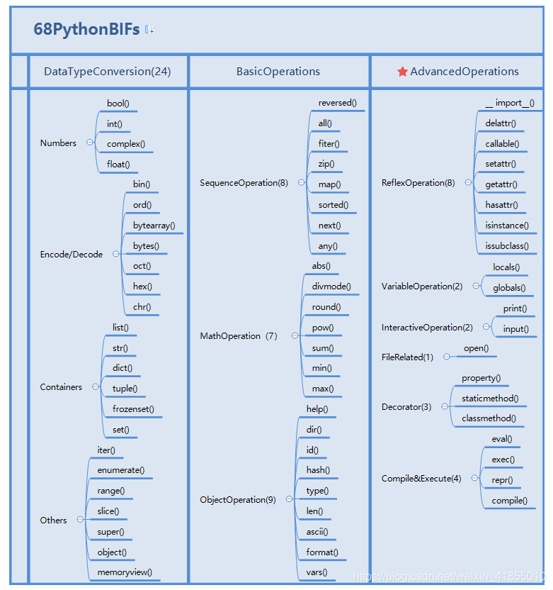
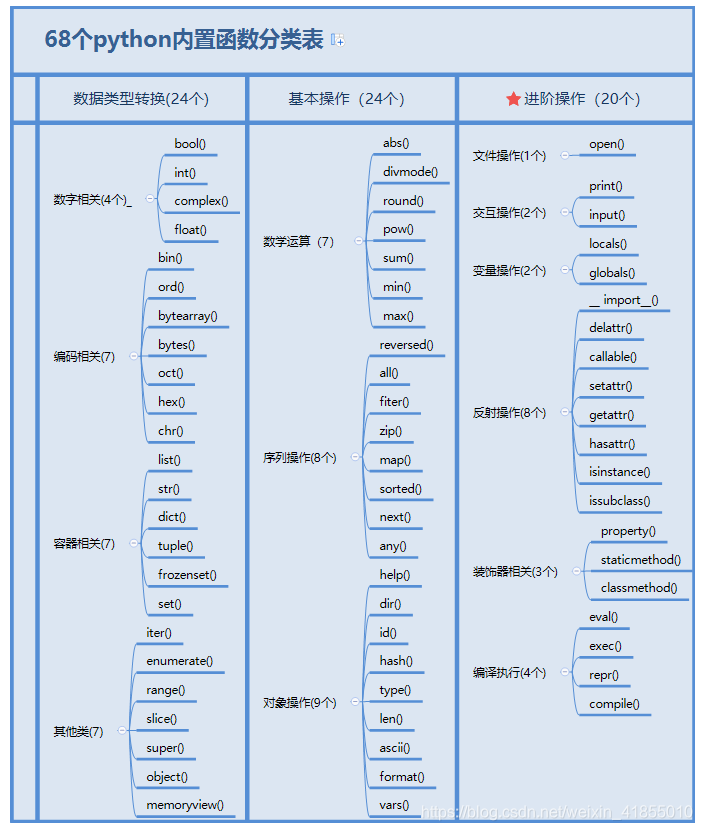

# Sorting-Algorithms in python


```
68个Python内置函数 

Python 最常用的 18 个内置模块

参考文档：
八大排序算法(原理+代码详解)Python版    https://blog.csdn.net/Alex_thomas/article/details/121239611
中文家讲解，带图文展示
(一)冒泡排序
(二)选择排序
(三)插入排序
(四)归并排序
(五)快速排序(挖坑填数)
(六)希尔排序(缩小增量排序)
(七)计数排序


Sorting and Searching Algorithms    https://www.programiz.com/dsa/bubble-sort
带图文展示，有 Python,C，C++ 三个版本：
Bubble Sort
Selection Sort
Insertion Sort
Merge Sort
Quicksort
Counting Sort
Radix Sort
Bucket Sort
Heap Sort
Shell Sort
Linear Search
Binary Search


10 Best Sorting Algorithms Explained    https://www.sitepoint.com/best-sorting-algorithms/
带图文展示


# 运行当前目录下py结尾的文件，看是否有错误输出
find ./ -name "*.py"|xargs -i python3 {}|egrep "rror|File"

# 把当前目录下**.c的文件，编译成名为**的可执行文件
A=`find ./ -name "*.c"`; for a in $A ; do gcc $a -o "`echo $a|awk -F '.' '{ print $2 }'|awk -F '/' '{ print $2 }'`"; done
A=`find ./ -name "*.c"`; for a in $A ; do gcc $a -o "`echo $a|awk -F '.' '{ print $2 }'|awk -F '/' '{ print $2 }'`"; ./"`echo $a|awk -F '.' '{ print $2 }'|awk -F '/' '{ print $2 }'`" ; done

# 
find  ./ -type f -executable |xargs -i rm -rf {}


```





```


https://w3schools.tech/zh-cn/tutorial/python/python_modules
Python模块
Python内置模块
Python - 内置函数

python内置函数：https://docs.python.org/3/library/functions.html
Built-in Functions
Python 69个 常用 内置函数
68个Python内置函数最全总结
Python中30个常见内置函数讲解

Built-in Modules in Python：https://www.geeksforgeeks.org/built-in-modules-in-python/
Python 最常用的 18 个内置模块：https://www.51cto.com/article/817543.html

```
